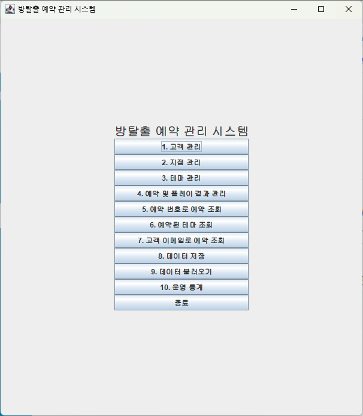
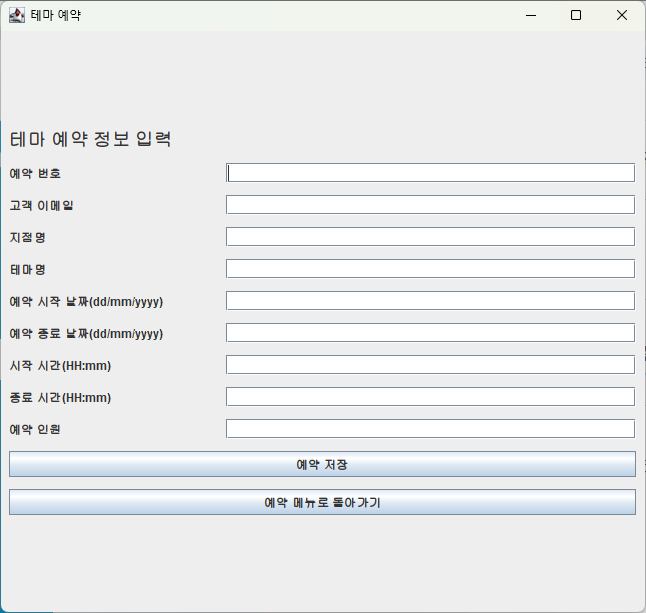
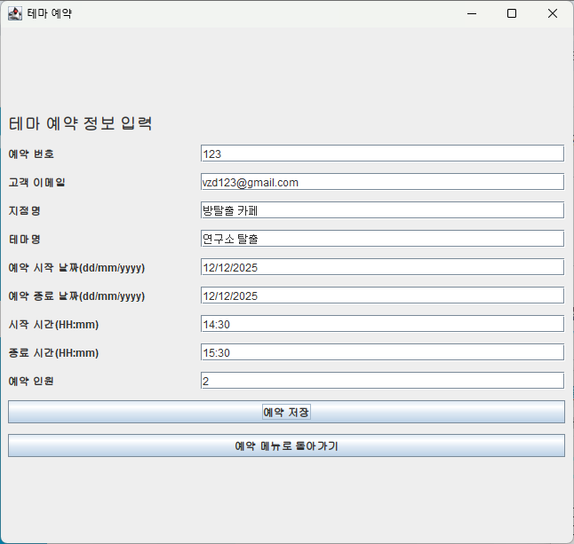
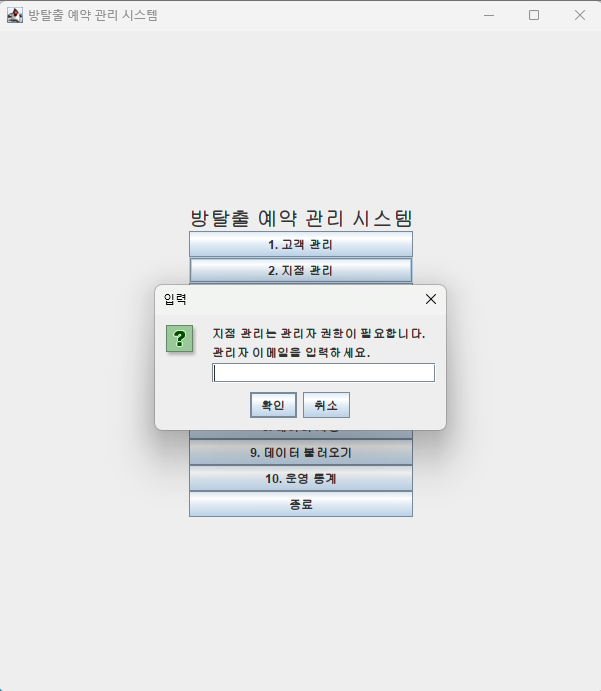
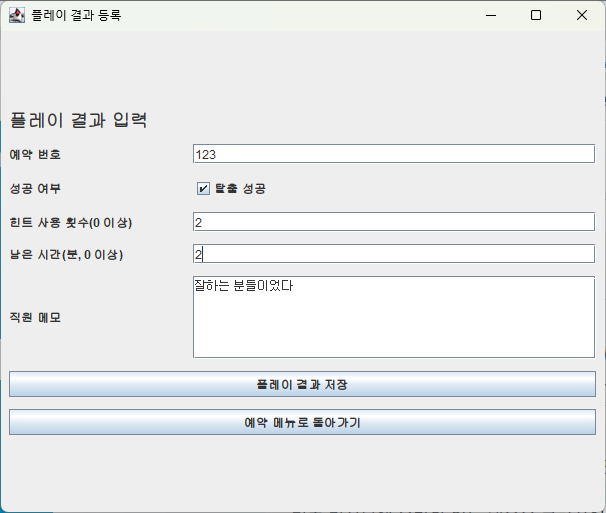
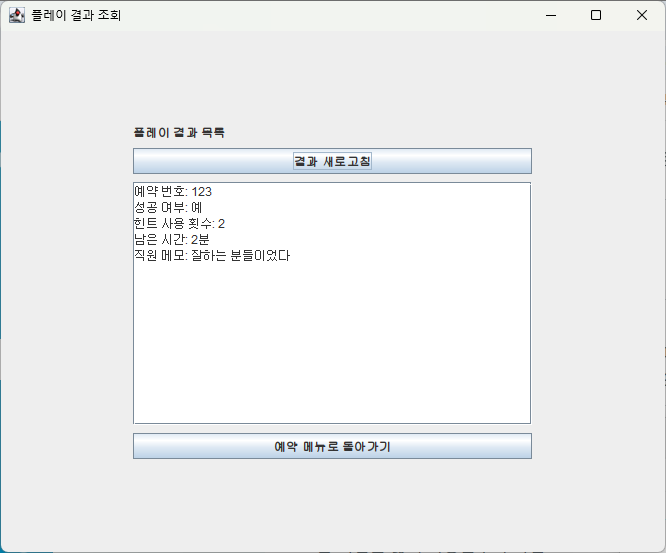
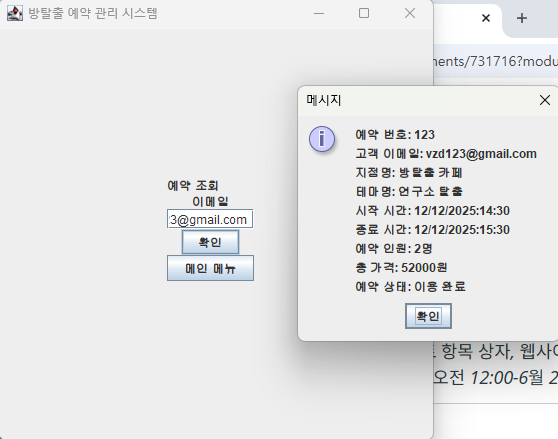

# 방탈출 예약 관리 시스템

## 1. 프로젝트명

**방탈출 예약 관리 시스템**  
Java Swing 기반 방탈출 카페 예약·고객·지점·테마·플레이 결과·운영 통계 관리 프로그램

---

## 2. 프로젝트 소개

이 프로젝트는 **Java 17과 Swing GUI를 기반으로 구현한 방탈출 카페 운영 관리 데스크톱 애플리케이션**입니다. 사용자는 GUI 또는 CLI를 통해 고객, 방탈출 카페 지점, 방탈출 테마, 예약, 플레이 결과를 관리할 수 있으며, 저장/불러오기 기능을 통해 실행 중 관리한 데이터를 파일로 보존할 수 있습니다.

기존 코드 구조에는 `User`, `Building`, `Room`과 같은 범용 모델명이 남아 있지만, 본 프로젝트에서는 아래와 같이 방탈출 카페 도메인에 맞게 해석합니다.

| 코드상 이름 | 본 프로젝트에서의 의미 |
| --- | --- |
| `User` | 고객/관리자 |
| `Building` | 방탈출 카페 지점 |
| `Room` | 방탈출 테마 |
| `Reservation` | 예약 |
| `PlayResult` | 플레이 결과 |
| `UserRole` | 사용자 역할 |
| `ReservationStatus` | 예약 상태 |
| `BookingResource` | View와 Service를 연결하는 컨트롤러 |

프로그램 시작 시 발표 시연을 쉽게 할 수 있도록 기본 지점과 기본 방탈출 테마가 자동 등록됩니다.

| 기본 테마명 | 장르 | 난이도 | 소요 시간 | 권장 인원 | 1인 가격 |
| --- | --- | --- | --- | --- | --- |
| 저택의 비밀 | 공포 | HARD | 60분 | 2~4명 | 28,000원 |
| 연구소 탈출 | SF | NORMAL | 60분 | 2~5명 | 26,000원 |
| 사라진 탐정 | 추리 | EASY | 50분 | 2~4명 | 24,000원 |

---

## 3. 원본 프로젝트 출처 및 변경 내역

이 프로젝트는 아래 공개 GitHub 저장소의 Java Swing 기반 Room Booking System을 클론한 뒤, 방탈출 카페 예약 관리 도메인에 맞게 변형·확장하여 만든 프로그램입니다.

* 원본 저장소: <https://github.com/ajaymahadeven/University-Room-Booking-Application-using-Java-Swing-and-TDD-Approach.git>
* 원본 프로젝트 개요: 대학교 강의실/공간 예약을 위해 사용자, 건물, 방, 예약을 추가·삭제·조회하고, GUI와 CLI를 함께 제공하는 Java 17 + Swing + MVC 기반 프로그램입니다.
* 본 프로젝트의 방향: 원본의 `User`, `Building`, `Room`, `Reservation`, `BookingResource`, Service, GUI/CLI 구조를 기반으로 유지하되, 실제 발표 주제를 **방탈출 카페 운영 관리 시스템**으로 재해석하고 필요한 모델·검증·통계 기능을 추가했습니다.

### 3.1 원본 프로젝트에서 이어받은 부분

| 구분 | 원본 프로젝트의 기능/구조 | 본 프로젝트에서의 활용 방식 |
| --- | --- | --- |
| 아키텍처 | MVC 구조(Model / View / Controller / Service) | 동일한 계층 구조를 유지하고 `BookingResource`가 GUI/CLI와 Service 사이를 중계하도록 사용 |
| 실행 방식 | Swing GUI와 CLI를 모두 제공 | GUI/CLI 양쪽에서 방탈출 예약 관리 기능을 실행할 수 있도록 유지 및 한글화 |
| 기본 모델 | `User`, `Building`, `Room`, `Reservation` | 클래스명은 유지하되 각각 고객/관리자, 지점, 방탈출 테마, 예약으로 의미를 재정의 |
| 데이터 관리 | `Map`, `HashMap` 기반 Service 저장소 | 이메일, 지점명, 테마명, 예약 번호를 key로 사용하는 구조를 유지 |
| 파일 저장 | Object Serialization 기반 저장/불러오기 | 고객·지점·테마·예약 데이터에 더해 플레이 결과 저장까지 확장 |
| 기본 예약 검증 | 예약 번호 중복, 날짜/시간 형식, 하루 초과 예약 방지, 5분 단위 검사 | 방탈출 테마 예약 중복 검사와 예약 인원/가격 검증을 추가하여 확장 |

### 3.2 본 프로젝트에서 변경·확장한 부분

| 변경 영역 | 원본 Room Booking System | 본 프로젝트 방탈출 예약 관리 시스템 |
| --- | --- | --- |
| 도메인 | 학교/건물의 일반 방 예약 | 방탈출 카페의 지점, 테마, 고객 예약, 플레이 결과 관리 |
| 용어와 UI | User / Building / Room / Booking 중심 영문 흐름 | 고객 / 지점 / 방탈출 테마 / 예약 / 플레이 결과 중심 한글 흐름 |
| 테마 정보 | `Room`은 방 이름, 건물명, 예약 여부만 저장 | 장르, 난이도, 플레이 시간, 최소·최대 인원, 1인 가격을 추가 |
| 예약 정보 | 예약 번호, 이메일, 건물, 방, 날짜/시간 중심 | 예약 인원, 총 가격, 예약 상태(`RESERVED`, `CANCELLED`, `COMPLETED`, `NO_SHOW`)를 추가 |
| 예약 취소 | 예약 삭제 중심 | 예약 기록을 보존하고 상태를 `CANCELLED`로 변경하여 이력과 통계에 활용 |
| 플레이 결과 | 별도 개념 없음 | `PlayResult` 모델과 Service를 추가해 성공 여부, 힌트 수, 남은 시간, 직원 메모를 기록 |
| 운영 통계 | 전체 예약 조회 중심 | `StatisticsService`를 추가해 예약 수, 성공률, 평균 힌트 수, 예상 매출, 인기 테마 등을 계산 |
| 권한 | README상 Role-Based Control 언급은 있으나 기능은 단순 | `UserRole` Enum과 관리자 이메일 검증을 추가해 지점/테마/통계 등 관리자 기능을 제한 |
| 기본 데이터 | 사용자가 직접 데이터 등록 | 시연 편의를 위해 기본 지점, 기본 테마, 관리자 계정을 프로그램 시작 시 자동 등록 |
| 검증 강화 | 날짜/시간, 중복 예약 위주 | 이메일, 빈 값, 테마 난이도, 인원 범위, 가격, 플레이 결과 음수 입력 등 검증 확대 |
| 문서화 | 원본 README는 기능 목록과 설치 방법 중심 | 방탈출 도메인 해석, 발표 시연 순서, 클래스 역할, 한계점, 개선 방향을 상세히 정리 |

요약하면, 본 프로젝트는 원본 저장소의 **Java Swing + CLI + MVC + 파일 저장 기반 예약 시스템 골격**을 출발점으로 삼고, 이를 **방탈출 카페 운영 시나리오에 맞는 도메인 모델, 예약 정책, 플레이 결과, 관리자 권한, 운영 통계 기능**으로 확장한 변형 프로젝트입니다.

## 4. 개발 목적

방탈출 카페 운영에서는 단순히 예약만 등록하는 것이 아니라, 고객 정보, 지점 정보, 테마 정보, 예약 시간, 플레이 결과, 힌트 사용 횟수, 성공률과 같은 데이터를 함께 관리해야 합니다.

본 프로젝트의 개발 목적은 다음과 같습니다.

1. **방탈출 카페 운영 흐름을 Java 객체지향 구조로 모델링**합니다.
2. **Swing GUI와 CLI를 모두 제공**하여 같은 기능을 다른 View 방식으로 사용할 수 있도록 합니다.
3. **MVC 구조와 Model / Service / Controller / View 계층 분리**를 적용하여 화면과 비즈니스 로직의 책임을 분리합니다.
4. **Collection Framework, Map, HashMap**을 활용해 고객, 지점, 테마, 예약, 플레이 결과 데이터를 관리합니다.
5. **File I/O와 Object Serialization**을 활용해 데이터를 파일로 저장하고 다시 불러옵니다.
6. **Stream API**를 활용해 예약 수, 평균 힌트 사용 횟수, 성공률 등 운영 통계를 계산합니다.
7. **예외 처리와 입력값 검증**을 통해 잘못된 예약, 중복 데이터, 잘못된 이메일/날짜/시간 입력을 방지합니다.

---

## 5. 사용 기술

| 기술 | 적용 내용 |
| --- | --- |
| Java 17 | 전체 프로그램 구현 언어 및 실행 환경 |
| Swing GUI | 데스크톱 화면 구현, 버튼/라벨/입력 필드/JOptionPane 사용 |
| CLI | 터미널 기반 메뉴 입력 방식 제공 |
| MVC 구조 | Model, View, Controller, Service 계층 분리 |
| Model 계층 | 고객, 지점, 테마, 예약, 플레이 결과 데이터 표현 |
| Service 계층 | 데이터 저장, 조회, 삭제, 검증, 통계 계산 담당 |
| Controller 계층 | `BookingResource`가 View와 Service 사이 요청을 중계 |
| View 계층 | Swing GUI 화면과 CLI 메뉴 담당 |
| Collection Framework | 여러 도메인 데이터를 컬렉션으로 관리 |
| Map / HashMap | 고객 이메일, 지점명, 테마명, 예약 번호 등을 key로 데이터 관리 |
| Enum | `ReservationStatus`로 예약 상태 표현 |
| File I/O | 서비스별 데이터를 파일로 저장하고 불러오기 |
| Object Serialization | 객체 Map 데이터를 직렬화하여 파일에 저장 |
| Stream API | 예약/플레이 결과 기반 운영 통계 계산 |
| 예외 처리 | 잘못된 입력, 중복 데이터, 미등록 데이터 접근 방지 |
| 입력값 검증 | 이메일, 날짜, 시간, 빈 값, 음수 입력 등 검증 |
| JUnit 테스트 구조 | `src/Tests/basic` 아래 기존 모델/서비스 테스트 구조 포함 |

---

## 6. 주요 기능

### 6.1 고객 관리

고객은 이메일을 기준으로 식별됩니다.

* 고객 추가
* 고객 삭제
* 전체 고객 조회
* 이메일 형식 검증
* 중복 고객 등록 방지
* 등록되지 않은 고객 접근 방지

### 6.2 방탈출 카페 지점 관리

지점은 테마가 운영되는 방탈출 카페의 지점 정보를 의미합니다.

* 지점 추가(관리자 권한 필요)
* 지점 삭제(관리자 권한 필요)
* 전체 지점 조회
* 지점명 중복 등록 방지
* 지점명과 주소 빈 값 검증
* 등록되지 않은 지점 접근 방지

### 6.3 방탈출 테마 관리

코드상 `Room` 모델을 방탈출 테마로 해석하여 사용합니다.

* 테마 추가(관리자 권한 필요)
* 테마 삭제(관리자 권한 필요)
* 전체 테마 조회
* 지점별 테마 조회
* 테마명 중복 등록 방지
* 등록되지 않은 테마 접근 방지
* 예약 가능 여부를 `isBooked` 값으로 관리
* 장르, 난이도, 플레이 시간, 최소/최대 인원, 1인 가격 입력 및 조회
* 플레이 시간은 1분 이상, 최소 인원은 1명 이상, 최대 인원은 최소 인원 이상, 가격은 0원 이상으로 검증
* 난이도는 `EASY`, `NORMAL`, `HARD` 중 하나 입력을 권장

### 6.4 예약 관리

예약은 예약 번호, 고객 이메일, 지점명, 테마명, 시작/종료 날짜와 시간, 예약 인원, 총 가격으로 구성됩니다. 총 가격은 선택한 테마의 1인 가격과 예약 인원을 곱해 자동 계산됩니다.

* 테마 예약 생성
* 예약 인원 입력 및 테마별 최소/최대 인원 검증
* 총 가격 자동 계산
* 예약 취소 처리(예약 기록은 유지하고 상태를 `CANCELLED`로 변경)
* 예약 번호로 예약 조회
* 고객 이메일로 예약 조회
* 전체 예약 현황 조회(관리자 권한 필요)
* 예약 번호 중복 방지
* 고객/지점/테마 존재 여부 확인
* 시작 시간과 종료 시간 검증
* 최소 5분 이상 예약 검증
* 5분 단위 예약 시간 검증
* 하루를 초과하는 예약 방지
* 같은 날짜와 테마의 예약 시간 중복 방지
* 취소된 예약은 중복 예약 검사에서 제외

### 6.5 플레이 결과 관리

플레이 결과는 예약 번호와 연결됩니다.

* 플레이 결과 등록
* 플레이 결과 목록 조회
* 탈출 성공 여부 저장
* 힌트 사용 횟수 저장
* 남은 시간 저장
* 직원 메모 저장
* 예약 번호 누락 검증
* 힌트 사용 횟수와 남은 시간이 0 이상인지 검증

### 6.6 운영 통계

`StatisticsService`는 예약 데이터와 플레이 결과 데이터를 바탕으로 운영 통계를 계산합니다.

* 전체 예약 수
* 예약 완료 수
* 취소 예약 수
* 완료된 플레이 수
* 전체 성공률
* 평균 힌트 사용 횟수
* 총 예상 매출
* 테마별 예약 수
* 테마별 성공률
* 가장 인기 있는 테마
* 힌트를 가장 많이 사용한 예약

통계 계산에는 `Stream API`, `Collectors.groupingBy`, `Collectors.counting`, `mapToInt`, `sum`, `max`, `average`, `orElse` 등이 사용됩니다. 총 예상 매출은 취소되지 않은 예약의 `totalPrice` 합계로 계산하며, 숫자는 `120,000원`처럼 읽기 쉬운 형식으로 출력합니다.

### 6.7 간단한 권한 검증

로그인 화면을 별도로 만들지는 않았지만, 관리자 기능 실행 시 관리자 이메일을 입력받아 `UserRole.ADMIN` 여부를 확인합니다.

| 역할 | 가능한 기능 |
| --- | --- |
| `CUSTOMER` | 예약 생성, 본인 예약 조회, 예약 취소 |
| `ADMIN` | 지점 추가/삭제, 테마 추가/삭제, 전체 예약 현황 조회, 운영 통계 조회 |

시연용 관리자 계정은 프로그램 시작 시 자동 등록되는 `manager@escaperoom.local`입니다. 일반 고객 이메일로 관리자 기능을 실행하면 `관리자 권한이 필요한 기능입니다.` 메시지가 표시됩니다.

### 6.8 데이터 저장 및 불러오기

GUI와 CLI 모두 데이터 저장/불러오기 기능을 제공합니다.

* 고객 데이터 저장/불러오기
* 지점 데이터 저장/불러오기
* 테마 데이터 저장/불러오기
* 예약 데이터 저장/불러오기
* 플레이 결과 데이터 저장/불러오기

---

## 7. 프로젝트 구조

```text
.
├── README.md
├── LICENSE
├── docs/
│   └── CLEANUP_CANDIDATES.md
├── src/
│   ├── RBSystem.java
│   ├── controller/
│   │   └── BookingResource.java
│   ├── model/
│   │   ├── Building/
│   │   │   └── Building.java
│   │   ├── PlayResult/
│   │   │   └── PlayResult.java
│   │   ├── Reservation/
│   │   │   ├── Reservation.java
│   │   │   └── ReservationStatus.java
│   │   ├── Room/
│   │   │   └── Room.java
│   │   └── User/
│   │       └── User.java
│   ├── service/
│   │   ├── BuildingService.java
│   │   ├── PlayResultService.java
│   │   ├── ReservationService.java
│   │   ├── RoomService.java
│   │   ├── StatisticsService.java
│   │   └── UserService.java
│   ├── view/
│   │   ├── CLI/
│   │   │   └── CommandLine.java
│   │   ├── GUI/
│   │   │   ├── BUILDINGS/
│   │   │   ├── ROOMS/
│   │   │   ├── Reservation/
│   │   │   ├── USER/
│   │   │   ├── Main_GUI.java
│   │   │   └── StatisticsGUI.java
│   │   └── ViewHandler.java
│   └── Tests/
│       └── basic/
└── University-Room-Booking-Application-using-Java-Swing-and-TDD-Approach.iml
```

---

## 8. 클래스 역할 설명

### 8.1 실행 클래스

| 클래스 | 역할 |
| --- | --- |
| `RBSystem` | 프로그램 시작점입니다. Service 객체를 생성하고 `BookingResource` 컨트롤러를 연결한 뒤 GUI 또는 CLI 실행 모드를 선택합니다. 또한 발표 시연용 기본 지점, 기본 테마, 샘플 관리자 계정을 등록합니다. |

### 8.2 Model 계층

| 클래스 | 프로젝트 도메인 | 역할 |
| --- | --- | --- |
| `User` | 고객/관리자 | 고객 이름, 이메일, 사용자 역할을 저장하고 이메일 형식을 검증합니다. |
| `Building` | 방탈출 카페 지점 | 지점명, 주소, 등록 고객 이메일 정보를 저장합니다. |
| `Room` | 방탈출 테마 | 테마명, 지점명, 예약 여부, 장르, 난이도, 플레이 시간, 최소/최대 인원, 1인 가격을 저장합니다. |
| `Reservation` | 예약 | 예약 번호, 고객 이메일, 지점명, 테마명, 예약 날짜/시간, 예약 인원, 총 가격, 예약 상태를 저장합니다. |
| `UserRole` | 사용자 역할 | `CUSTOMER`, `ADMIN` 역할을 Enum으로 표현합니다. |
| `ReservationStatus` | 예약 상태 | `RESERVED`, `CANCELLED`, `COMPLETED`, `NO_SHOW` 상태를 Enum으로 표현합니다. |
| `PlayResult` | 플레이 결과 | 예약 번호, 성공 여부, 힌트 사용 횟수, 남은 시간, 직원 메모를 저장합니다. |

### 8.3 Service 계층

| 클래스 | 역할 |
| --- | --- |
| `UserService` | 고객/관리자 추가, 삭제, 조회, 고객 존재 여부 확인, 관리자 권한 검증, 고객 데이터 저장/불러오기를 담당합니다. |
| `BuildingService` | 지점 추가, 삭제, 조회, 지점 존재 여부 확인, 지점 데이터 저장/불러오기를 담당합니다. |
| `RoomService` | 테마 추가, 삭제, 조회, 예약 여부 변경, 테마 데이터 저장/불러오기를 담당합니다. |
| `ReservationService` | 예약 생성, 취소 상태 변경, 예약 번호/이메일 기준 조회, 예약 중복 검증, 예약 인원과 총 가격 저장, 예약 데이터 저장/불러오기를 담당합니다. |
| `PlayResultService` | 플레이 결과 등록, 조회, 플레이 결과 데이터 저장/불러오기를 담당합니다. |
| `StatisticsService` | 예약과 플레이 결과를 기반으로 운영 통계를 계산합니다. |

### 8.4 Controller 계층

| 클래스 | 역할 |
| --- | --- |
| `BookingResource` | GUI/CLI에서 들어온 요청을 Service 계층으로 전달합니다. 또한 예약 날짜, 시간, 최소 예약 시간, 5분 단위 예약, 하루 초과 예약 여부를 검증합니다. |

### 8.5 View 계층

| 클래스/패키지 | 역할 |
| --- | --- |
| `view.GUI.Main_GUI` | Swing 메인 메뉴 화면입니다. 고객, 지점, 테마, 예약, 저장/불러오기, 통계 화면으로 이동합니다. |
| `view.GUI.USER` | 고객 추가, 삭제, 조회 화면을 제공합니다. |
| `view.GUI.BUILDINGS` | 지점 추가, 삭제, 조회 화면을 제공합니다. |
| `view.GUI.ROOMS` | 방탈출 테마 추가, 삭제, 조회 화면을 제공합니다. |
| `view.GUI.Reservation` | 예약 생성/삭제, 예약 조회, 플레이 결과 등록/조회 화면을 제공합니다. |
| `view.GUI.StatisticsGUI` | 운영 통계 결과를 Swing 화면으로 보여줍니다. |
| `view.CLI.CommandLine` | 터미널 기반 메뉴를 제공하며 GUI와 같은 핵심 기능을 CLI로 실행할 수 있게 합니다. |
| `ViewHandler` | GUI/CLI 실행 상태를 구분하는 플래그를 관리합니다. |

---

## 9. 실행 방법

### 9.1 준비 사항

* JDK 17 이상
* 터미널 또는 IntelliJ IDEA
* GUI 실행 시 그래픽 환경이 필요합니다.
* 한글 출력을 위해 UTF-8 인코딩 사용을 권장합니다.

### 9.2 터미널에서 컴파일

프로젝트 루트에서 다음 명령어를 실행합니다.

```bash
mkdir -p out
find src -name '*.java' ! -path 'src/Tests/*' -print0 | xargs -0 javac -encoding UTF-8 -d out
```

`src/Tests` 아래 테스트 코드는 JUnit 의존성이 필요하므로 위 기본 컴파일 명령에서는 제외합니다.

### 9.3 GUI 실행

```bash
java -cp out RBSystem --gui
```

실행 후 Swing 메인 화면에서 고객 관리, 지점 관리, 테마 관리, 예약 및 플레이 결과 관리, 통계 화면으로 이동할 수 있습니다.

### 9.4 CLI 실행

```bash
java -cp out RBSystem --cli
```

CLI 실행 시 다음과 같은 메뉴가 표시됩니다.

```text
방탈출 예약 관리 시스템에 오신 것을 환영합니다.

1. 고객 추가/삭제/조회
2. 지점 추가/삭제/조회
3. 방탈출 테마 추가/삭제/조회
4. 테마 예약/예약 취소
5. 예약 번호로 예약 조회
6. 전체 예약 현황 조회
7. 고객 이메일로 예약 조회
8. 데이터 저장
9. 데이터 불러오기
0. 종료
```

### 9.5 IntelliJ IDEA에서 실행

1. IntelliJ IDEA에서 프로젝트 폴더를 엽니다.
2. Project SDK를 JDK 17 이상으로 설정합니다.
3. `src` 폴더를 Sources Root로 설정합니다.
4. `src/RBSystem.java`를 엽니다.
5. `main` 메서드 옆 실행 버튼을 클릭합니다.
6. Program arguments에 필요에 따라 다음 값을 입력합니다.
   * `--gui`: Swing GUI 실행
   * `--cli`: CLI 실행

그래픽 환경이 없는 경우 프로그램은 CLI 모드로 실행됩니다.

---

## 10. 실행 결과

프로그램의 주요 GUI 화면은 다음과 같습니다. 각 이미지는 프로젝트 루트의 `images` 폴더에 포함되어 있습니다.

### 10.1 메인 화면



프로그램 실행 후 고객, 지점, 테마, 예약, 저장/불러오기, 통계 기능으로 이동할 수 있는 메인 화면입니다.

### 10.2 테마 예약 화면



예약할 방탈출 테마를 선택하고 예약 절차를 시작하는 화면입니다.

### 10.3 테마 예약 정보 입력 화면



예약자 정보, 예약 날짜와 시간, 예약 인원 등 필요한 예약 내용을 입력하는 화면입니다.

### 10.4 지점 관리 화면



방탈출 카페 지점 정보를 추가, 삭제, 조회할 수 있는 관리자용 화면입니다.

### 10.5 플레이 결과 입력 화면



예약 번호와 연결해 탈출 성공 여부, 힌트 사용 횟수, 남은 시간, 직원 메모를 입력하는 화면입니다.

### 10.6 플레이 결과 조회 화면



등록된 플레이 결과 목록과 상세 내용을 확인하는 화면입니다.

### 10.7 예약 조회 화면



예약 번호 또는 고객 정보를 기준으로 등록된 예약 내역을 확인하는 화면입니다.

---

## 11. 시연 순서

발표 시에는 아래 순서로 진행하면 프로젝트의 핵심 기능과 적용 기술을 자연스럽게 설명할 수 있습니다.

### 11.1 GUI 시연 권장 흐름

1. **프로그램 실행**
   * `java -cp out RBSystem --gui`로 실행합니다.
   * 메인 화면에서 고객, 지점, 테마, 예약, 통계 메뉴를 확인합니다.

2. **기본 데이터 확인**
   * 프로그램 시작 시 기본 지점, 기본 방탈출 테마, 시연용 관리자 계정(`manager@escaperoom.local`)이 등록되어 있음을 설명합니다.
   * 테마 조회 화면에서 기본 테마 목록을 확인합니다.

3. **고객 관리 시연**
   * 고객 추가 화면에서 이메일과 이름을 입력해 고객을 등록합니다.
   * 전체 고객 조회로 등록 결과를 확인합니다.
   * 잘못된 이메일 또는 빈 입력 시 예외 메시지가 표시되는 점을 설명합니다.

4. **지점 관리 시연**
   * 지점 추가 화면에서 관리자 이메일(`manager@escaperoom.local`)을 입력한 뒤 지점명과 주소를 등록합니다.
   * 전체 지점 조회로 등록 결과를 확인합니다.

5. **테마 관리 시연**
   * 관리자 이메일(`manager@escaperoom.local`)을 입력한 뒤 지점명을 기준으로 방탈출 테마를 추가합니다.
   * 전체 테마 조회로 테마가 등록되었는지 확인합니다.

6. **테마 상세 정보 확인**
   * 테마 조회 화면에서 장르, 난이도, 플레이 시간, 권장 인원, 1인 가격이 표시되는지 확인합니다.

7. **예약 생성 시연**
   * 예약 번호, 고객 이메일, 지점명, 테마명, 날짜, 시작 시간, 종료 시간, 예약 인원을 입력합니다.
   * 선택한 테마의 최소/최대 인원 범위 안에서만 예약되는지 확인합니다.
   * 예약 완료 메시지와 함께 조회 화면에서 총 가격이 자동 계산되어 표시되는지 확인합니다.
   * 같은 예약 번호 또는 중복 시간 예약 시 검증 메시지가 출력되는 점을 설명합니다.

8. **예약 조회 시연**
   * 예약 번호로 예약을 조회합니다.
   * 고객 이메일로 예약 목록을 조회합니다.
   * 전체 예약 현황에서 예약 인원과 총 가격이 함께 표시되는지 확인합니다.

9. **플레이 결과 등록 시연**
   * 예약 번호와 연결하여 성공 여부, 힌트 사용 횟수, 남은 시간, 직원 메모를 입력합니다.
   * 힌트 사용 횟수와 남은 시간이 음수이면 검증 메시지가 표시되는 점을 설명합니다.

10. **운영 통계 확인**
   * 관리자 이메일(`manager@escaperoom.local`)을 입력한 뒤 운영 통계 화면에서 전체 예약 수, 예약 완료 수, 취소 예약 수, 총 예상 매출, 인기 테마, 힌트 최다 사용 예약까지 확인합니다.
   * `StatisticsService`에서 Stream API를 활용한다는 점을 설명합니다.

11. **데이터 저장/불러오기**
    * 메인 화면에서 데이터 저장을 실행하고 `데이터가 성공적으로 저장되었습니다.` 메시지를 확인합니다.
    * 프로그램을 다시 실행한 뒤 데이터 불러오기로 저장된 데이터를 복원할 수 있음을 설명합니다.
    * 저장 파일이 없는 상태에서 불러오기를 실행하면 `저장된 데이터가 없어 새로 시작합니다.` 메시지가 표시되는 점을 확인합니다.

### 11.2 CLI 시연 권장 흐름

1. `java -cp out RBSystem --cli`로 CLI를 실행합니다.
2. 메인 메뉴가 한글로 표시되는 것을 확인합니다.
3. 고객 추가/조회 메뉴를 실행합니다.
4. 테마 조회 또는 예약 생성 메뉴를 실행합니다.
5. 데이터 저장/불러오기 메뉴를 실행합니다.

---

## 12. 적용한 Java 개념

### 12.1 객체지향 설계

고객, 지점, 테마, 예약, 플레이 결과를 각각 Model 클래스로 분리했습니다. 각 객체는 자신에게 필요한 데이터를 필드로 가지고, Service 계층은 이 객체들을 생성·저장·조회합니다.

### 12.2 MVC 구조와 계층 분리

프로젝트는 다음 계층으로 나뉩니다.

| 계층 | 설명 |
| --- | --- |
| Model | 도메인 데이터 표현 |
| View | GUI/CLI 화면과 사용자 입력 처리 |
| Controller | View 요청을 Service로 전달 |
| Service | 데이터 관리, 검증, 저장/불러오기, 통계 계산 |

이 구조를 통해 화면 코드가 직접 데이터를 조작하지 않고 `BookingResource`를 통해 Service에 요청하도록 구성했습니다.

### 12.3 Collection Framework와 Map/HashMap

각 Service는 `Map` 또는 `HashMap`을 사용해 데이터를 관리합니다.

| 데이터 | 주요 key |
| --- | --- |
| 고객 | 이메일 |
| 지점 | 지점명 |
| 테마 | 테마명 |
| 예약 | 예약 번호 |
| 플레이 결과 | 예약 번호 |

이를 통해 key 기반 조회, 중복 확인, 삭제를 구현했습니다.

### 12.4 Enum

`UserRole` Enum으로 고객/관리자 권한을 구분하고, `ReservationStatus` Enum을 사용해 예약 상태를 표현합니다.

```java
public enum UserRole {
    CUSTOMER,
    ADMIN
}
```

```java
public enum ReservationStatus {
    RESERVED,
    CANCELLED,
    COMPLETED,
    NO_SHOW
}
```

예약 생성 시 기본 상태는 `RESERVED`이며, 예약 취소 시 Map에서 삭제하지 않고 `CANCELLED`로 변경합니다. 플레이 결과를 등록하면 해당 예약은 `COMPLETED` 상태로 변경됩니다. 취소된 예약은 이력 조회와 통계에는 남지만, 같은 날짜/테마의 중복 예약 검사에서는 제외됩니다.

### 12.5 File I/O와 Object Serialization

Service 클래스들은 `FileOutputStream`, `ObjectOutputStream`, `FileInputStream`, `ObjectInputStream`을 사용해 객체 Map 데이터를 파일로 저장하고 다시 불러옵니다.

### 12.6 Stream API

`StatisticsService`에서는 Stream API를 사용해 통계를 계산합니다.

* `mapToInt(...).sum()`으로 총 예상 매출 계산
* `mapToInt(...).average()`로 평균 힌트 사용 횟수와 성공률 계산
* `Collectors.groupingBy(...)`로 테마별 예약 그룹화
* `Collectors.counting()`으로 테마별 예약 수 계산
* `max(...)`로 가장 인기 있는 테마와 힌트 최다 사용 예약 계산
* 데이터가 없는 경우 `orElse(...)`로 기본값 처리

### 12.7 예외 처리와 입력값 검증

잘못된 입력이 들어오면 `IllegalArgumentException`을 발생시키고, GUI에서는 `JOptionPane`, CLI에서는 콘솔 출력으로 사용자에게 안내합니다.

---

## 13. 예외 처리 및 입력 검증

본 프로젝트는 사용자 입력이 잘못되었을 때 기능이 비정상적으로 진행되지 않도록 여러 계층에서 검증합니다.

### 13.1 고객 검증

* 이메일 형식 검증
* 이메일 빈 값 검증
* 이름 빈 값 검증
* 중복 고객 등록 방지
* 등록되지 않은 고객 접근 방지

### 13.2 권한 검증

* 지점 추가/삭제 전 관리자 이메일 검증
* 테마 추가/삭제 전 관리자 이메일 검증
* 전체 예약 현황 조회 전 관리자 이메일 검증
* 운영 통계 조회 전 관리자 이메일 검증
* 일반 고객 계정으로 관리자 기능 접근 시 차단

### 13.3 지점 검증

* 지점명 빈 값 검증
* 주소 빈 값 검증
* 중복 지점 등록 방지
* 등록되지 않은 지점 접근 방지

### 13.4 테마 검증

* 테마명 빈 값 검증
* 장르와 난이도 빈 값 검증
* 플레이 시간 1분 이상 검증
* 최소 인원 1명 이상 검증
* 최대 인원이 최소 인원 이상인지 검증
* 1인 가격 0원 이상 검증
* 난이도 `EASY`, `NORMAL`, `HARD` 입력 검증
* 중복 테마 등록 방지
* 등록되지 않은 테마 접근 방지
* 지점이 존재하는지 확인 후 테마 등록

### 13.5 예약 검증

* 예약 번호 빈 값 검증
* 예약 번호 중복 검증
* 고객 존재 여부 검증
* 지점 존재 여부 검증
* 테마 존재 여부 검증
* 예약 인원 숫자 입력 검증
* 예약 인원 1명 이상 검증
* 예약 인원이 테마의 최소/최대 인원 범위 안에 있는지 검증
* 날짜 형식 검증
* 시간 형식 검증
* 시작 시간이 종료 시간보다 늦지 않은지 검증
* 예약 시간이 최소 5분 이상인지 검증
* 예약 시간이 5분 단위인지 검증
* 하루를 초과하는 예약 방지
* 같은 날짜와 테마의 예약 시간 중복 방지
* 취소된 예약은 중복 예약 검사에서 제외

### 13.6 플레이 결과 검증

* 예약 번호 빈 값 검증
* 힌트 사용 횟수 0 이상 검증
* 남은 시간 0 이상 검증

---

## 14. 데이터 저장 방식

프로그램은 메모리의 `Map` 데이터를 파일로 저장하고 다시 불러옵니다. 저장 방식은 **File I/O + Object Serialization**입니다.

| 데이터 | 담당 Service | 저장 파일 |
| --- | --- | --- |
| 고객 | `UserService` | `userData.txt` |
| 지점 | `BuildingService` | `buildingData.txt` |
| 테마 | `RoomService` | `roomData.txt` |
| 예약 | `ReservationService` | `resData.txt` |
| 플레이 결과 | `PlayResultService` | `playResultData.txt` |

저장 흐름은 다음과 같습니다.

```text
현재 Map 데이터
→ ObjectOutputStream으로 직렬화
→ txt 파일에 저장
```

불러오기 흐름은 다음과 같습니다.

```text
저장된 txt 파일
→ ObjectInputStream으로 역직렬화
→ Service 내부 Map에 복원
```

이 방식은 별도 데이터베이스 없이도 프로그램 실행 중 생성한 데이터를 보존할 수 있다는 장점이 있습니다. 각 Service는 저장 파일명을 상수로 관리하고, `try-with-resources`로 스트림을 닫습니다. 저장 파일이 없으면 예외로 프로그램을 종료하지 않고 `저장된 데이터가 없어 새로 시작합니다.` 메시지를 반환합니다. 파일이 손상되었거나 읽기에 실패하면 GUI는 `JOptionPane`, CLI는 콘솔 출력으로 한글 오류 메시지를 보여줍니다.

> 참고: 고객 모델에 사용자 역할 필드가 추가되었고, 방탈출 테마 모델에 장르, 난이도, 플레이 시간, 인원, 가격 필드가 추가되었으며 예약 모델에도 예약 인원과 총 가격 필드가 추가되었습니다. 기존 버전에서 생성한 `userData.txt`, `roomData.txt` 또는 `resData.txt`는 직렬화 클래스 구조 차이로 불러오기가 실패할 수 있으므로, 문제가 발생하면 기존 저장 파일을 삭제한 뒤 새 형식으로 다시 저장하는 것을 권장합니다.

---

## 15. 현재 한계점

현재 구현된 기능을 기준으로 다음 한계가 있습니다.

* 데이터베이스를 사용하지 않고 로컬 직렬화 파일에 저장하므로 여러 사용자가 동시에 사용하는 환경에는 적합하지 않습니다.
* 별도 로그인 화면은 없으며, 관리자 기능 실행 시 관리자 이메일을 입력받아 권한을 검증하는 간단한 방식입니다.
* 날짜와 시간 입력이 텍스트 기반이므로 사용자가 형식을 정확히 입력해야 합니다.
* 예약 상태는 취소와 플레이 완료까지 반영하지만, 노쇼 처리 화면은 아직 별도로 제공하지 않습니다.
* Swing 화면은 기능 중심으로 구성되어 있어 실제 상용 서비스 수준의 UI 디자인은 아닙니다.
* 테스트 구조는 존재하지만 기본 컴파일 명령에서는 JUnit 의존성 문제를 피하기 위해 `src/Tests`를 제외합니다.
* 운영 통계는 예약과 플레이 결과 데이터를 기반으로 계산하지만 시간대별 예약률, 고객 재방문율 같은 고급 분석은 포함하지 않습니다.

---

## 16. 향후 개선 방향

현재 구현을 기반으로 다음 기능을 추가하면 더 완성도 높은 방탈출 카페 운영 시스템으로 확장할 수 있습니다.

* 데이터베이스 연동
  * 파일 저장 방식 대신 MySQL, PostgreSQL, SQLite 등으로 데이터 관리
* 로그인 및 권한 관리
  * 별도 로그인 화면, 세션 관리, 관리자/일반 고객 화면 분리
* 예약 상태 관리 확장
  * 노쇼 처리 화면, 고객 사유별 취소 상태, 상태 변경 이력 관리 추가
* 날짜/시간 선택 UI 개선
  * 텍스트 입력 대신 Date Picker, Time Picker 적용
* 테마 정보 모델 추가 확장
  * 현재 문자열로 관리하는 장르와 난이도를 별도 Enum으로 분리
* 통계 기능 확장
  * 시간대별 예약률, 고객 재방문율, 월별 매출 추이 추가
* 테스트 환경 정리
  * JUnit 실행 환경을 표준 빌드 도구와 연결
* UI 개선
  * Swing 화면 배치, 폰트, 색상, 표 형태 출력 등을 개선
* 다국어 지원 구조 도입
  * 문자열을 코드에 직접 작성하지 않고 리소스 파일로 분리

---

## 17. 제출 및 발표 핵심 포인트

발표에서 강조할 만한 핵심 포인트는 다음과 같습니다.

1. 방탈출 카페 도메인을 고객, 지점, 테마, 예약, 플레이 결과로 모델링했습니다.
2. Java Swing GUI와 CLI를 모두 제공하여 View 계층을 다양화했습니다.
3. `BookingResource`를 중심으로 View와 Service를 분리했습니다.
4. `Map`과 `HashMap`을 사용해 도메인 데이터를 key 기반으로 관리했습니다.
5. File I/O와 Object Serialization으로 데이터를 저장하고 불러옵니다.
6. Stream API로 전체 성공률, 평균 힌트 수, 총 예상 매출, 인기 테마, 힌트 최다 사용 예약을 계산합니다.
7. 예외 처리와 입력값 검증을 통해 잘못된 예약과 중복 데이터를 방지합니다.
8. `ReservationStatus` Enum을 통해 예약 상태 확장 가능성을 확보했습니다.

---

## License

이 프로젝트는 MIT License를 따릅니다. 자세한 내용은 `LICENSE` 파일을 참고하세요.
